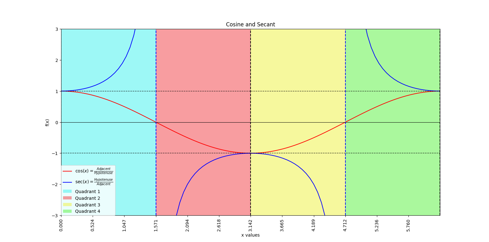

# Trigonometric Representation of cosine and secant

This project visualizes trigonometric functions using matplotlib

## Diagram:


## Install - using Git
1. Clone the repository:
   ```bash
   git clone [https://github.com/user/repo.git](https://github.com/BogdanVlad06/Cosine-and-Secant-diagram)
   
2. To setup virtual environment:
   ```bash
   python -m venv venv
   venv\Scripts\activate
3. Install dependencies:
   ```bash
   pip install -r requirements.txt
